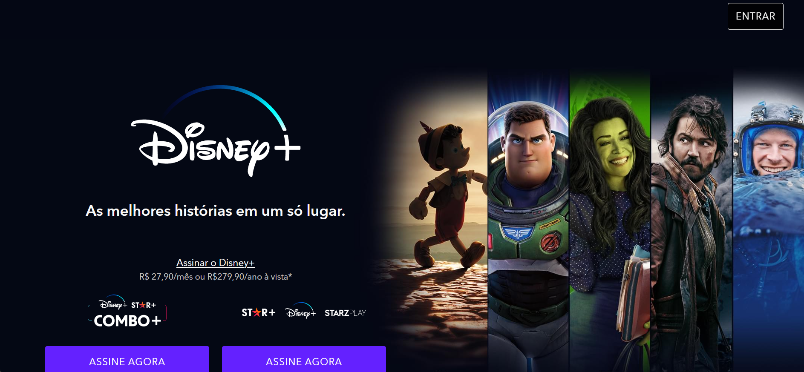

  

<h1 align="center">Clone do site da Disney+</h1>

<h1 align="center">
    <a href="https://vercel.com/staanb/disney-plus-clone">🔗 Clique aqui para acesar o site!</a>
</h1>

🚀 Clone do Disney+ feito para o curso da EBAC Front-end.

Tabela de conteúdos
=================

 <a href="#-objetivo">Objetivo</a> •
 <a href="#-tecnologias">Tecnologias</a> •  
 <a href="https://github.com/StaanB/EPLAY/blob/main/LICENSE">Licença</a> • 
 <a href="#autor">Autor</a>

<h4 align="center"> 
	✅ Clone do Disney+ 🚀 Projeto finalizado.  ✅
</h4>

### ✅ Objetivo

💡O clone foi feito com intuito apenas de treinar as ferramentas de design e landing page, nenhuma das funcionaliadades foi realmente aplicada e o objetivo é somente a estética e acessibilidade da página.

### 💻 Tecnologias

<h2>Lista de tecnologias utilizadas nesse projeto: </h2>

• Javascript

• SCSS

• Uglify

• Gulp

<h3><a href="https://github.com/StaanB/DISNEY-PLUS-CLONE/blob/main/LICENSE">⚖️LICENÇA</a></h3>

### 🧑🏻Autor
---

<a href="https://github.com/StaanB">
 
  
 <b>Stanley Brenner</b></a> <a href="https://stanley-b.vercel.app/" title="Stanley">🚀</a>

Feito por Stanley 👋🏽 Entre em contato!

 

